# GMGN.AI UX 流程图文档

## 📊 用户交互流程图

### 1. 用户注册/登录流程

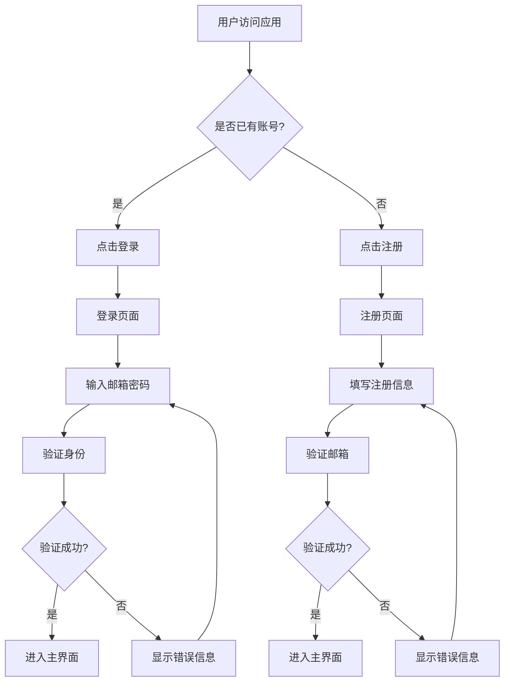

### 2. 钱包连接流程

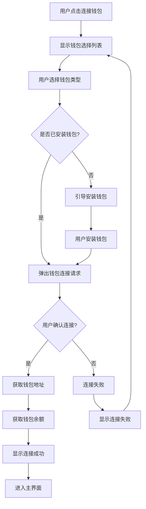

### 3. Monitor模块智能卡片查看流程

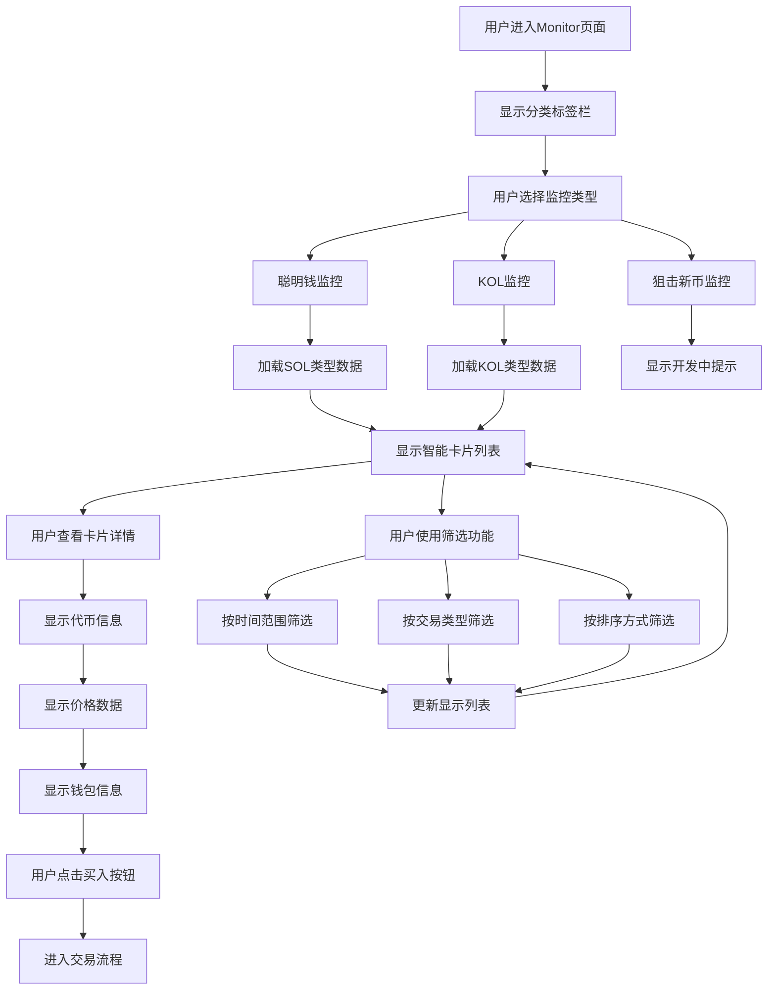

### 4. 智能卡片交互流程

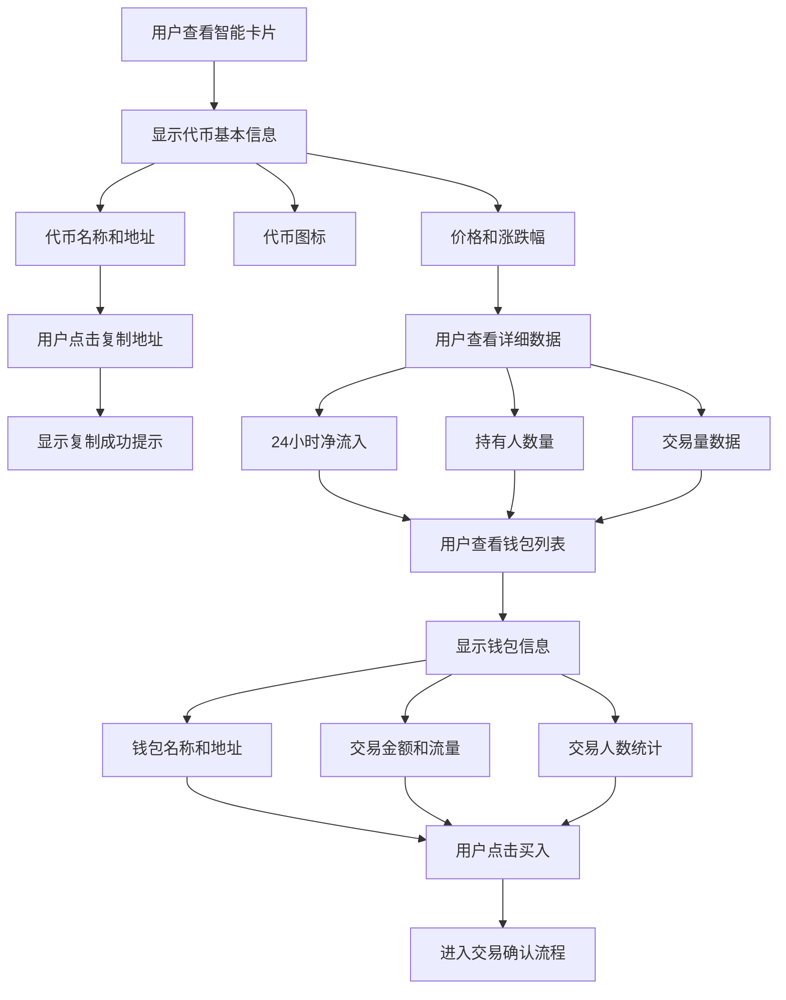

### 5. 市场数据查看流程

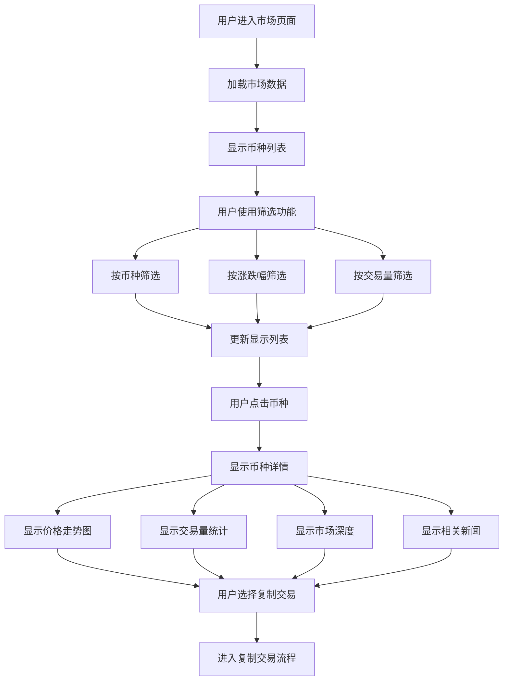

## 🎯 页面状态转换图

### Monitor页面状态转换

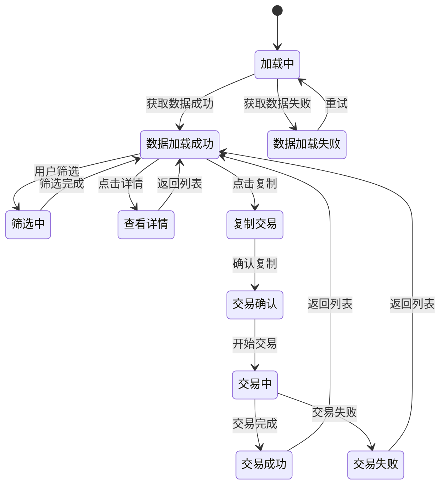

### 主界面状态转换

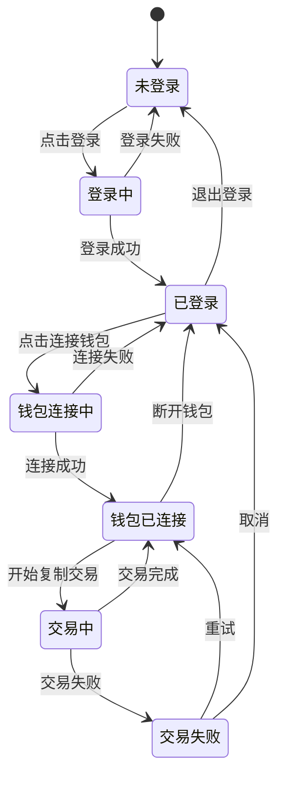

## 📱 响应式布局流程图

### 桌面端布局 (> 1024px)

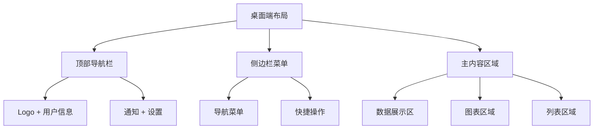

### 平板端布局 (768px - 1024px)

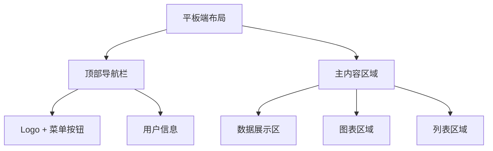

### 移动端布局 (< 768px)

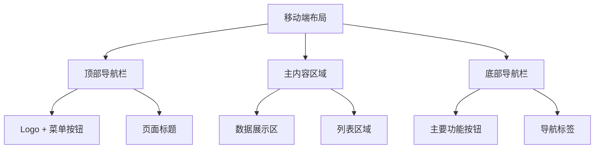

## 🎨 Monitor模块组件结构图

### 智能卡片组件结构

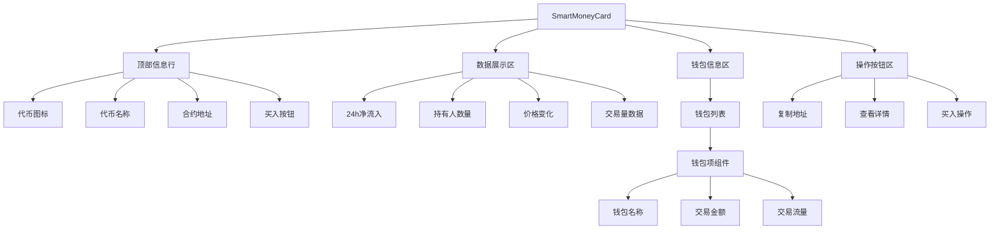

### 分类标签栏组件

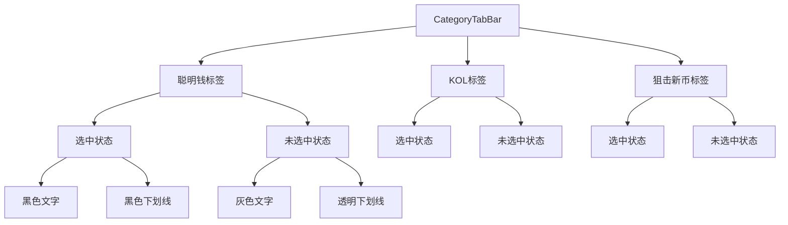

## 🔄 数据流图

### Monitor模块数据流

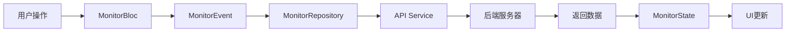

### 智能卡片数据流

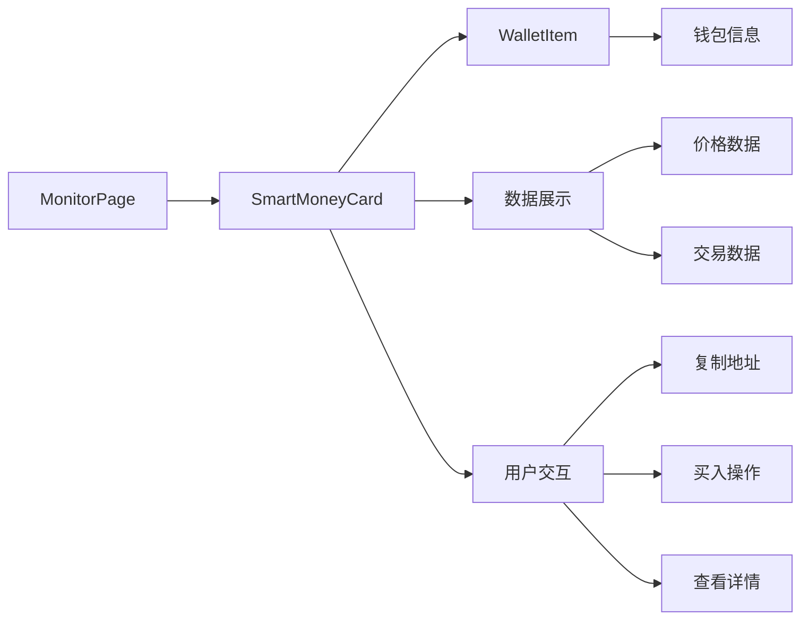

## 📊 性能监控流程图

### 页面加载性能

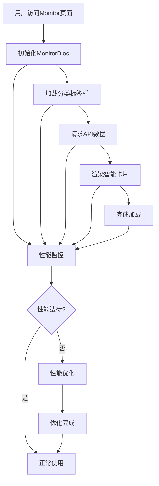

### 错误处理流程

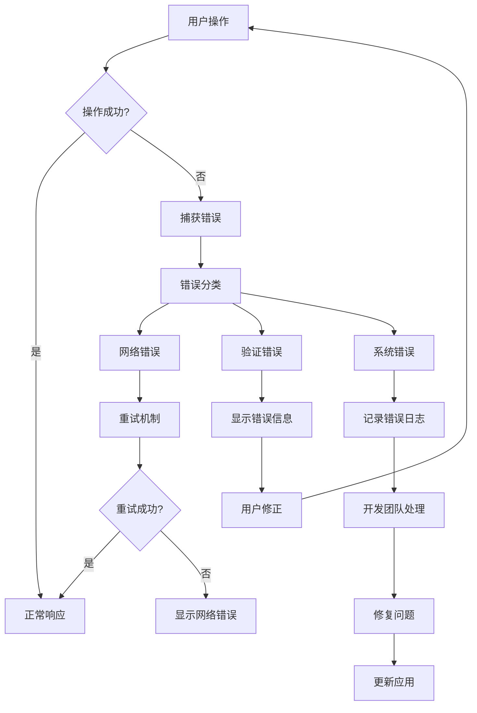

## 🎨 设计系统流程图

### Monitor模块设计流程

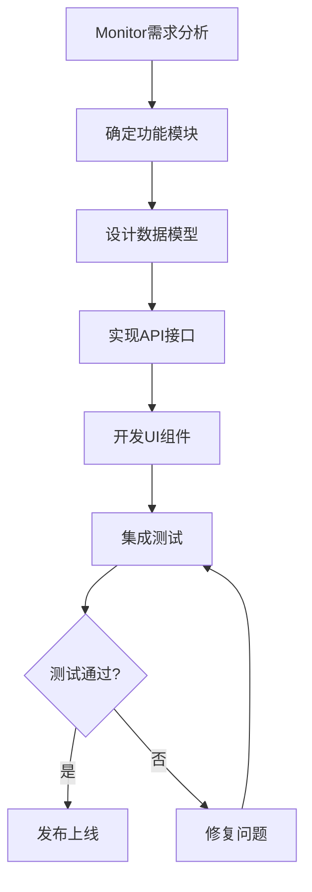

### 组件设计流程

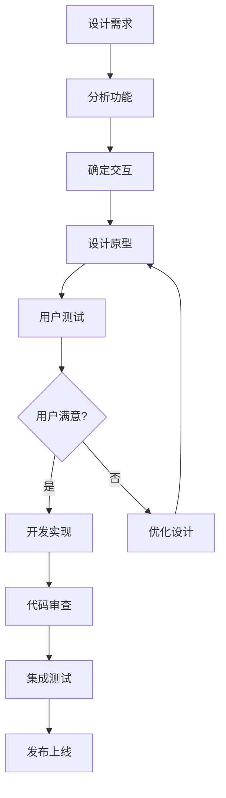

## 📈 用户行为分析流程

### Monitor模块用户行为跟踪

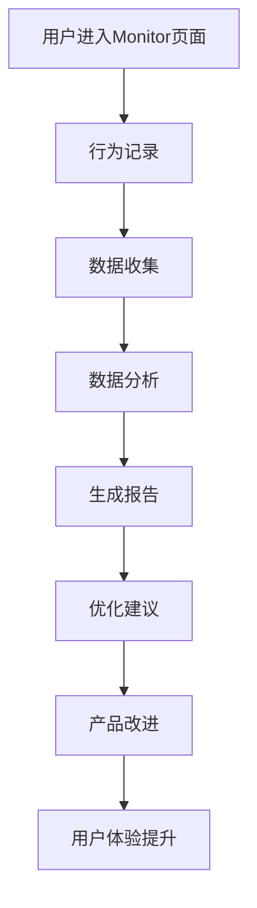

### 智能卡片交互分析

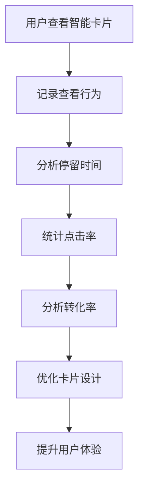

## 🎯 Monitor模块功能特点

### 1. 数据展示
- **智能卡片**: 展示代币基本信息、价格数据、交易统计
- **钱包信息**: 显示相关钱包的交易详情和统计
- **实时数据**: 支持24小时、7天、30天时间范围的数据

### 2. 用户交互
- **分类切换**: 聪明钱、KOL、狙击新币三种类型
- **筛选功能**: 按时间、交易类型、排序方式筛选
- **复制功能**: 一键复制代币地址
- **买入操作**: 快速进入交易流程

### 3. 响应式设计
- **移动端优化**: 适配不同屏幕尺寸
- **触摸友好**: 优化移动端交互体验
- **加载状态**: 提供良好的加载反馈

### 4. 错误处理
- **网络重试**: 自动重试失败的请求
- **错误提示**: 友好的错误信息展示
- **降级处理**: 网络异常时的降级方案

## 📝 技术实现要点

### 1. 架构设计
- **Bloc模式**: 使用Bloc进行状态管理
- **模块化**: 清晰的模块划分和职责分离
- **可扩展**: 支持新功能模块的快速集成

### 2. 数据管理
- **API集成**: 与后端API的完整集成
- **缓存策略**: 合理的数据缓存机制
- **状态同步**: 确保数据状态的一致性

### 3. UI组件
- **可复用**: 高度可复用的组件设计
- **一致性**: 统一的设计语言和交互模式
- **性能优化**: 高效的渲染和更新机制

---

**文档版本**: v2.0.0  
**最后更新**: 2024年12月  
**作者**: GMGN.AI 开发团队  
**状态**: 基于实际项目实现更新完成 